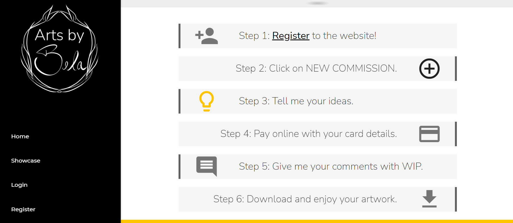

# Arts by Bela - Testing Protocol

[Demo of Website](https://arts-by-bela.herokuapp.com/)

Refer to [Main project file](README.md) for further detail.

## Code validation

- [W3C CSS Jigsaw Validator](https://jigsaw.w3.org/css-validator/)
- [W3C Markup Validator](https://validator.w3.org/#validate_by_input)
- [JSHint Validator](https://jshint.com/)
- [Python Validator](http://pep8online.com/) 

All CSS, JS and Python files were validated and returned no errors at the time of this entry.
Auto generated Python files, as "app/migrations/*.py" were not validated as they are not created manually.

The HTML templates were tested by direct input of the rendered website. The errors returned were related to Materialize / Stripe auto generated code. No written custom HTML returned errors. HTML content emails were not validated as there was inline styling being auto-gerenerated from django-inlinecss.

The following templates and scenarios were tested:

- index.html
- showcase.html - with and without artworks on database
- personal_work.html
- profile.html - with and without commissions on database
- new_commission.html
- edit_commission.html
- payment.html 
- payment_success.html
- wip_details.html - as client and as artist with and without wip_illustration/client_comment
- artwork_details.html - as client and as artist with and without final_illustration/client_review
- artwork_details.html - as personal work of artist 

## User stories testing

### As a new visitor to the website,

1. I want to know more about the artist.
   

    - Loading the home page, the first section has a small introduction about the artist.
2. I want to see previous completed artworks.
   

    - From the navigation bar, I can load the Showcase page that has examples of the artist's work.
3. I want to read reviews from previous costumers.
   

    - On the Showcase page, I can click on the image and the client review is displayed.
4. I want to find instructions on how to commission an artwork.
   

    - Loading the home page, the second section has the steps on how to commission a new illustration.
5. I want to calculate a quote for the commission.
   

    - Loading the home page, the third section is an interactive quote calculator depending on my illustration requirements.

### As a registered user,

1. I want to request a new commission.
   

    - Once logged in, I´m redirected to the profile page that has a new commission button. Clicking that button loads the form for me to include my commission request details.
2. I want to pay for the new commission.
   

    - By clicking proceed to payment, I can review and pay for my commission by card.
3. I want to be notified as my commission is in progress.
   

    - Once the commission is paid and the artist uploads the illustration, I am notified via email.
4. I want to request changes to the artwork, if necessary.
   

    - From my profile, I can navigate to the Illustration details and submit comments to the artist.
5. I want to be notified  and download my completed art work.
   

    - Once the artist uploads the illustration, I am notified via email and I can navigate to the illustration details from my profile to download the image.
6. I want access to previous artwork commissions I have ordered, if any.
   

    - From my profile, I can see a list of my commissions and redirect to the details page of each commission.
### As the artist,

1. I want to be notified as commissions are requested and commented on.
   

    - As the artist, I receive all emails during the commission workflow.
2. I want to upload the artworks and submit for comments and download.
   

    - From the commission details page, I can upload the images and submit them to the client.

## Python Testing
Custom test cases were written for each application. A total of 65 test were completed. Coverage of 100% was achieved for each application, except Payments. The Webhook Handling and Stripe integration was tested manually.

### Commissions
```
Name                                                      Stmts   Miss  Cover
-----------------------------------------------------------------------------
commissions/__init__.py                                       0      0   100%
commissions/admin.py                                         16      0   100%
commissions/apps.py                                           4      0   100%
commissions/context.py                                        6      0   100%
commissions/forms.py                                         25      0   100%
commissions/migrations/0001_initial.py                        5      0   100%
commissions/migrations/0002_auto_20210820_1403.py             4      0   100%
commissions/migrations/0003_auto_20210820_1407.py             4      0   100%
commissions/migrations/0004_size.py                           4      0   100%
commissions/migrations/0005_alter_size_size.py                4      0   100%
commissions/migrations/0006_auto_20210820_1910.py             4      0   100%
commissions/migrations/0007_commission.py                     5      0   100%
commissions/migrations/0008_auto_20210902_1145.py             4      0   100%
commissions/migrations/0009_auto_20210904_1240.py             6      0   100%
commissions/migrations/0010_alter_wip_client_comment.py       4      0   100%
commissions/migrations/0011_artwork.py                        5      0   100%
commissions/migrations/0012_auto_20210913_1019.py             4      0   100%
commissions/migrations/__init__.py                            0      0   100%
commissions/models.py                                        96      0   100%
commissions/templatetags/split_filter.py                      5      0   100%
commissions/testsModels.py                                   79      0   100%
commissions/testsViews.py                                   399      0   100%
commissions/urls.py                                           3      0   100%
commissions/views.py                                        171      0   100%
-----------------------------------------------------------------------------
TOTAL                                                       857      0   100%
```

### Home
```
Name                          Stmts   Miss  Cover
-------------------------------------------------
home/__init__.py                  0      0   100%
home/apps.py                      4      0   100%
home/migrations/__init__.py       0      0   100%
home/tests.py                     6      0   100%
home/urls.py                      3      0   100%
home/views.py                     7      0   100%
-------------------------------------------------
TOTAL                            20      0   100%
```

### Payments
```
Name                              Stmts   Miss  Cover
-----------------------------------------------------
payments/__init__.py                  0      0   100%
payments/apps.py                      4      0   100%
payments/migrations/__init__.py       0      0   100%
payments/tests.py                    53      0   100%
payments/urls.py                      4      0   100%
payments/views.py                    47      8    83%
payments/webhook_handler.py          49     35    29%
payments/webhooks.py                 28     19    32%
-----------------------------------------------------
TOTAL                               185     62    66%
```

### Profiles
```
Name                                             Stmts   Miss  Cover
--------------------------------------------------------------------
profiles/__init__.py                                 0      0   100%
profiles/admin.py                                    5      0   100%
profiles/apps.py                                     4      0   100%
profiles/forms.py                                   11      0   100%
profiles/migrations/0001_initial.py                  7      0   100%
profiles/migrations/0002_auto_20210913_1019.py       4      0   100%
profiles/migrations/__init__.py                      0      0   100%
profiles/models.py                                  15      0   100%
profiles/tests.py                                   54      0   100%
profiles/urls.py                                     3      0   100%
profiles/views.py                                   22      0   100%
--------------------------------------------------------------------
TOTAL                                              125      0   100%
```

### Showcase
```
Name                              Stmts   Miss  Cover
-----------------------------------------------------
showcase/__init__.py                  0      0   100%
showcase/apps.py                      4      0   100%
showcase/forms.py                     8      0   100%
showcase/migrations/__init__.py       0      0   100%
showcase/tests.py                    50      0   100%
showcase/urls.py                      3      0   100%
showcase/views.py                    38      0   100%
-----------------------------------------------------
TOTAL                               103      0   100%
```

## Manual testing of features

The deployed Heroku website was viewed on  desktops screens (21 and 13 inches) and also on Motorola G6 Play device.

The website was tested with Google Chrome (v.93.0), Mozilla Firefox (v.91) and Microsoft Edge (v.93) browsers.

On mobile, it was viewed with Google Chrome application v.93.0 on Android 9.

The Developer Tools of Google Chrome (v.93) on desktop was used to verify responsiveness on different devices. 

**Testing notes**:
a - At least 2 different Resolutions and 2 different Sizes have to be set on the database.
b - The tester needs access to a superuser account. This will be referred on the Test Steps as Artist Account.
c - The tester needs access to an email to create a regular user account. [TempMail](https://temp-mail.org/en/) can be used for this, but the session should remain open throughout the testing. This account will be referred on the Test Steps as Client Account.
d - The test is designed to follow the website workflow, ideally all test steps should be executed consecutively. 

1. **Home Page**:

   | Test No. | Action & expected results                                    | Pass / Fail |
   | -------- | :----------------------------------------------------------- | :---------- |
   | 1.1 | Navigate to https://arts-by-bela.herokuapp.com/ and verify the Home page loads. | Pass |
   | 1.2 | Scroll to the bottom of the home page and select different Resolutions, Sizes and Number of Characters. Verify your quote is updated accordingly. | Pass |


2. **User Authentication**:

   | Test No. | Action & expected results                                    | Pass / Fail |
   | -------- | :----------------------------------------------------------- | :---------- |
   | 2.1 | From the Navigation Bar, click on the Register link and verify the registration page loads. | Pass |
   | 2.2 | Enter email (https://temp-mail.org/en/), username and password and click on SIGN UP. Verify a confirmation email is sent. Confirm the email to be used on this account. | Pass |
   | 2.3 | From the Navigation Bar, click on the Login link and verify the login page loads. | Pass |
   | 2.4 | Enter the credentials of the user created in step 2.2 and click SIGN IN. Verify the Profile page loads. | Pass |
   | 2.5 | From the Navigation Bar, click on the Logout link and verify the user is logged out. | Pass |


3. **Profile**:

   | Test No. | Action & expected results                                    | Pass / Fail |
   | -------- | :----------------------------------------------------------- | :---------- |
   | 3.1 | Login into the system as in step 2.4 with the Client Account. On the Profile page, verify your username is displayed at the top of the page. | Pass |
   | 3.2 | Click on "Your info" and verify a form with First and Last name fields drops down. | Pass |
   | 3.3 | Enter "Test" in both fields and click UPDATE. Verify the page is reloaded. Click in "Your info" once again, verify the fields have been updated. | Pass |
   | 3.4 | Navigate to https://arts-by-bela.herokuapp.com/admin and Login using the Artist Account (superuser credentials). Under Profiles App, open the User Profiles collection. Verify the First and Last Names of the Client Account have been updated to "Test" on the database. | Pass |


4. **New Commission**:

   | Test No. | Action & expected results                                    | Pass / Fail |
   | -------- | :----------------------------------------------------------- | :---------- |
   | 4.1 | Login into the system as in step 2.4 with the Client Account. On the Profile page, click on NEW COMMISSION and verify the New Commission page loads. | Pass |
   | 4.2 | On the New Commissions page, click on CANCEL. Verify the Profile Page loads. | Pass |
   | 4.3 | Click on NEW COMMISSION once again. Verify the Resolution and Size options available matches the Database. | Pass |
   | 4.4 | Click on the Plus Sign button on the Mood Board and chose an image file. Verify the image preview loads and another Plus Sign button is available. | Fail* |
   | 4.5 | Click on REMOVE next to the Mood Board Image and verify the image is Cleared. Re-add the image. | Pass |
   | 4.6 | Repeat steps 4.4 and 4.5 to each available Plus button. Verify a total of 5 images can be uploaded. | Pass |
   | 4.7 | Change the selected Resolution, Size and the amount of Characters. Verify the total value is updated accordingly. | Pass |
   | 4.8 | Enter a Name and Description and click on PROCEED TO PAYMENT. Verify the Payment Page loads. Verify all the information and images matches the submitted on the form. Copy the Order Number. | Pass |
   | 4.9 | Navigate to https://arts-by-bela.herokuapp.com/admin and Login using the Artist Account. Under Commissions App, open the Commissions collection. Verify a commission has been created with the details and files entered on the steps above. | Pass |

* The button to add other images did not show. The JavaScript mood-bord.js looked for the next img field where the scr attribute was a blank string. During code refactoring, all img field scr attributes were updated to # symbol, not to throw a validation error. Issue was corrected by updating the if statement to === "#"


5. **Edit/Delete Commission**:

   | Test No. | Action & expected results                                    | Pass / Fail |
   | -------- | :----------------------------------------------------------- | :---------- |
   | 5.1 | Login into the system as in step 2.4 with the Client Account. On the Profile page, verify the Commission created in step 4.8 is now listed under "Your Commissions".  Verify the Commission status is "Waiting Payment" | Pass |
   | 5.2 | Click on the Details Symbol Button of the created commission. Verify the Edit Commission page loads. Verify all fields are filled in correctly and the Mood Board images are visible. | Fail* |
   | 5.3 | Update a field and click on PROCEED TO PAYMENT. Verify that field is updated on the Payments page.<br />Navigate to https://arts-by-bela.herokuapp.com/admin and Login using the Artist Account. Under Commissions App, open the Commissions collection. Verify  the updated field on the database. | Pass |
   | 5.4 | On the Payments page, click on RETURN. Verify the Edit commission page loads. | Pass |
   | 5.5 | On the Edit commission page, click on DELETE. Verify a Modal opens to confirm deletion. Click on CANCEL and verify nothing happens. Click on DELETE again and confirm on the Modal. Verify the Profile page loads and the commission is no longer listed under "Your Commissions".<br />Navigate to https://arts-by-bela.herokuapp.com/admin and Login using the Artist Account. Under Commissions App, open the Commissions collection. Verify the commission was removed from the Database. | Pass |


* The Resolution and Size were not updating to selected options, and just defaulting to the default option of the Model Class. To fix the issue, the script  select_resolution_size.js was written to set the selected values and recalculate total at document ready.


6. **Payments**:

   | Test No. | Action & expected results                                    | Pass / Fail |
   | -------- | :----------------------------------------------------------- | :---------- |
   | 6.1 | From the Profile page, create a new commission and click on PROCEED TO PAYMENT. Enter a card test details from [Stripe](https://stripe.com/docs/testing#cards). Verify the payments goes through and the Payment Success page loads.  | Pass |
   | 6.2 | Navigate to https://arts-by-bela.herokuapp.com/admin and Login using the Artist Account. Under Commissions App, open the Wips collection. Verify a WIP was created associated with the paid commission. | Pass |
   | 6.3 | On the Client Account email provider, verify an email was received confirming the Commission Request. On the Artist Account, verify the same email was received. | Pass |
   | 6.4 | Return to the Profile page of the Client Account and verify the Commission status is In Progress. | Pass |
   | 6.5 | Login with the Artist Account and navigate to the Profile, verify the payed commission is now available to the Artist. | Pass |


* Note: the valid payment was tested once again after the webhook implementation.


7. **WIP Illustration**:

   | Test No. | Action & expected results                                    | Pass / Fail |
   | -------- | :----------------------------------------------------------- | :---------- |
   | 7.1 | From the Profile page with the Artist Account, click on the Details symbol button of the In Progress Commission. Verify the WIP details page loads. | Pass |
   | 7.2 | On the WIP page, verify all the Commission information is available. Click on the Mood Board and verify it drops down to reveal the reference images. | Pass |
   | 7.3 | On the WIP page, click on CHOOSE FILE and upload a image file. Verify the image preview is loaded and the SEND TO CLIENT button is available. | Pass |
   | 7.4 | Click on SEND TO CLIENT and verify the page reloads. Return to the Profile, and verify the Commission status is Waiting comment.<br />Navigate to https://arts-by-bela.herokuapp.com/admin and Login using the Artist Account. Under Commissions App, open the Wips collection. Verify on the WIP details that the wip_illustration was uploaded.| Pass |
   | 7.5 | On the Client Account email provider, verify an email was received confirming the Illustration Upload. On the Artist Account, verify the same email was received. | Pass |


8. **WIP Comment**:

   | Test No. | Action & expected results                                    | Pass / Fail |
   | -------- | :----------------------------------------------------------- | :---------- |
   | 8.1 | From the Profile page with the Client Account, click on the Details symbol button of the Waiting Comment Commission. Verify the WIP details page loads. | Pass |
   | 8.2 | On the WIP page, verify all the Commission information is available and the uploaded WIP picture is available. | Pass |
   | 8.3 | On the WIP page, enter a test comment and click SUBMIT COMMENT. Verify the Profile page loads and verify the Commission status is Final work in progress. | Pass |
   | 8.4 | Navigate to https://arts-by-bela.herokuapp.com/admin and Login using the Artist Account. Under Commissions App, open the Wips collection. Verify on the WIP details that the client_comment was updated. | Pass |
   | 8.5 | Navigate to https://arts-by-bela.herokuapp.com/admin and Login using the Artist Account. Under Commissions App, open the Artworks collection. Verify a Artwork was created associated with the commented WIP commission. | Pass |
   | 8.6 | On the Artist Account email provider, verify an email was received confirming the Comment Upload. | Pass |


9. **Artwork Illustration**:

   | Test No. | Action & expected results                                    | Pass / Fail |
   | -------- | :----------------------------------------------------------- | :---------- |
   | 9.1 | From the Profile page with the Artist Account, click on the Details symbol button of the Final work in progress Commission. Verify the Artwork details page loads. | Pass |
   | 9.2 | On the Artwork page, verify all the Commission information is available. Click on the Mood Board and verify it drops down to reveal the reference images. | Pass |
   | 9.3 | On the Artwork page, click on the WIP Illustration and verify it drops down to reveal the WIP images. | Pass |
   | 9.4 | On the Artwork page, click on CHOOSE FILE and upload a image file. Verify the image preview is loaded and the SEND TO CLIENT button is available. | Pass |
   | 9.5 | Click on SEND TO CLIENT and verify the page reloads. Return to the Profile, and verify the Commission status is Complete.<br />Navigate to https://arts-by-bela.herokuapp.com/admin and Login using the Artist Account. Under Commissions App, open the Artworks collection. Verify on the Artwork details that the final_illustration was uploaded. | Pass |
   | 9.6 | On the Client Account email provider, verify an email was received confirming the Illustration Upload. On the Artist Account, verify the same email was received. | Pass |


10. **Artwork Review**:

| Test No. | Action & expected results                                    | Pass / Fail |
| -------- | :----------------------------------------------------------- | :---------- |
| 10.1 | From the Profile page with the Client Account, click on the Details symbol button of the Complete Commission. Verify the Artworks details page loads. | Pass |
| 10.2 | On the Artwork page, verify all the Commission and WIP information is available and the uploaded Final picture is available. Click on DOWNLOAD button and verify the image opens in another tab. | Pass* |
| 10.3 | On the  page, enter a test review and click SUBMIT REVIEW. Verify the profile page loads. | Pass |
| 10.4 | Navigate to https://arts-by-bela.herokuapp.com/admin and Login using the Artist Account. Under Commissions App, open the Artworks collection. Verify on the Artworks details that the client_review was updated. | Pass |
| 10.5 | On the Artist Account email provider, verify an email was received confirming the Review Upload. | Pass |


* See Known Issues below.


11. **Showcase**:

| Test No. | Action & expected results                                    | Pass / Fail |
| -------- | :----------------------------------------------------------- | :---------- |
| 11.1 | From the Navigation Bar, click on the Showcase link. Verify the Showcase page loads with all the artwork illustrations. On Mobile, this is a carousel. | Pass |
| 11.2 | On the Showcase, desktop view, click on a illustration and verify the illustration increases in side and the Name, Review and User is displayed. | Pass |
| 11.3 | Click on a different illustration, and verify the previous illustration returns to its initial state. | Pass |


12. **Personal Work**:

| Test No. | Action & expected results                                    | Pass / Fail |
| -------- | :----------------------------------------------------------- | :---------- |
| 12.1 | Login with the Artist Account and navigate to the Showcase page. Verify the NEW PERSONAL WORK button is available. Click the button and verify the Personal Work page loads. | Pass |
| 12.2 | Click on CANCEL and verify the Showcase page loads. Click on the NEW PERSONAL WORK button once again. | Pass |
| 12.3 | Enter a Name and Description. Click on CHOOSE FILE and select an image file. Verify the image preview is loaded. | Pass |
| 12.4 | Click on the ADD button and verify the Showcase page loads with the newly added artwork. | Pass |
| 12.5 | Navigate to https://arts-by-bela.herokuapp.com/admin and Login using the Artist Account. Under Commissions App, open the Commissions collection. Verify a Commission was created for the newly added artwork with the Name and Description entered.<br />On the Wips collection, verify a WIP was created associated with the newly added commission.<br />On the Artworks collection, verify an Artwork was created associated with the newly added commission. On the Artwork details, verify the client_review matches the Description entered on the form and that final_illustration is uploaded. | Pass |


   ### Known issues

- The files are only open on a new tab, instead of downloaded from the S3 bucket on the deployed environment. To fix this issue, the Content-Disposition of the file has to be set at custom storage classes. This was not implemented to avoid data transfer fees. For further information, refer to [StackOverflow](https://stackoverflow.com/questions/43208401/add-dynamic-content-disposition-for-file-namesamazon-s3-in-python).
- When adding images on Mozilla, files with extension .jfif were not available for selection. Microsoft Edge and Google Chrome allowed selection and upload of those files.